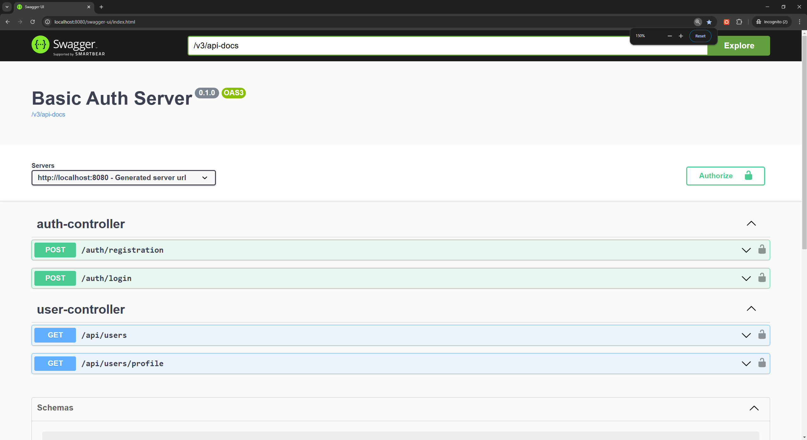

# JWT Auth Server

This project is a basic authentication server using JWT (JSON Web Token) for securing endpoints. It is built with Java, Spring Boot 3.1, and PostgreSQL.
## Features

- JWT-based authentication
- Swagger UI for API documentation
- Stateless session management

## Prerequisites

- Java 11 or higher
- Gradle
- PostgreSQL (or any other SQL database)

## Getting Started

### Configure the database

Update the `application.properties` file in `src/main/resources` with your database configuration.

```properties
spring.datasource.url=jdbc:postgresql://localhost:5432/authorization
spring.datasource.username=your-username
spring.datasource.password=your-password
spring.jpa.hibernate.ddl-auto=update
```

### Build the project

```sh
./gradlew build
```

### Run the application

```sh
./gradlew bootRun
```

### Access Swagger UI

Once the application is running, you can access the Swagger UI at:

```
http://localhost:8080/swagger-ui/index.html
```

## API Documentation

The API documentation is available via Swagger UI. Below are some screenshots of the Swagger UI:

### Swagger UI Home


